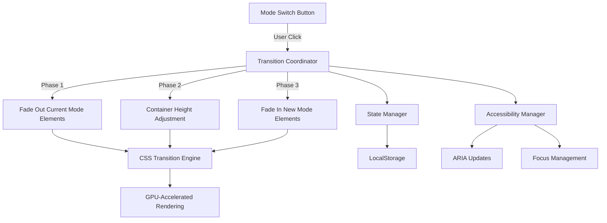

# Design Document: Smooth Buddy Container Transition

## Overview

This design document specifies the technical implementation for enhancing the buddy container transition smoothness when switching between automatic chat mode (Chat Otomatis) and chat input mode (Chat Input). The current implementation uses basic CSS transitions with max-height, opacity, and transform properties, but suffers from timing coordination issues, visual glitches, and abrupt animations.

The enhanced solution will implement a sophisticated transition engine that orchestrates multiple CSS animations with precise timing, uses GPU-accelerated properties for optimal performance, and provides a polished, fluid user experience across all devices.

### Key Design Goals

1. **Smooth Height Transitions**: Container height changes should feel natural with proper easing
2. **Coordinated Element Timing**: Elements should appear/disappear in a staggered, sequential manner
3. **Zero Visual Glitches**: No overflow issues, text reflow, or interaction conflicts during transitions
4. **High Performance**: Maintain 30+ FPS on moderate devices using GPU acceleration
5. **Accessibility**: Full keyboard navigation and screen reader support during transitions

## Architecture

### System Components



### Component Responsibilities

#### 1. Transition Coordinator (JavaScript)
- Orchestrates the multi-phase transition sequence
- Manages timing delays between animation phases
- Prevents rapid-click conflicts through debouncing
- Triggers CSS class changes at precise moments
- Coordinates with State Manager and Accessibility Manager

#### 2. CSS Transition Engine (CSS)
- Defines all animation properties and timing functions
- Uses GPU-accelerated properties (transform, opacity)
- Implements easing functions for smooth motion
- Handles element visibility states through classes
- Maintains overflow control during transitions

#### 3. State Manager (JavaScript)
- Tracks current mode (auto/chat)
- Persists mode preference to localStorage
- Manages DOM element visibility states
- Preserves chat history and user input context
- Handles scroll position restoration

#### 4. Accessibility Manager (JavaScript)
- Updates ARIA attributes during mode changes
- Manages focus transitions to appropriate elements
- Announces mode changes to screen readers
- Ensures keyboard navigation remains functional

## Components and Interfaces

### 1. Transition Coordinator Module

**Location**: `resources/views/dashboard.blade.php` (JavaScript section)

**Interface**:
```javascript
class BuddyTransitionCoordinator {
    constructor(config) {
        this.config = {
            phaseDuration: 400,        // Duration of each transition phase (ms)
            staggerDelay: 100,         // Delay between element animations (ms)
            debounceDelay: 500,        // Debounce delay for rapid clicks (ms)
            easingFunction: 'cubic-bezier(0.16, 1, 0.3, 1)'
        };
        this.isTransitioning = false;
        this.transitionQueue = [];
    }
    
    /**
     * Initiates mode switch transition
     * @param {string} targetMode - 'auto' or 'chat'
     * @returns {Promise<void>}
     */
    async switchMode(targetMode) {}
    
    /**
     * Phase 1: Fade out current mode elements
     * @param {string} currentMode
     * @returns {Promise<void>}
     */
    async fadeOutCurrentMode(currentMode) {}
    
    /**
     * Phase 2: Adjust container height
     * @returns {Promise<void>}
     */
    async adjustContainerHeight() {}
    
    /**
     * Phase 3: Fade in new mode elements
     * @param {string} targetMode
     * @returns {Promise<void>}
     */
    async fadeInNewMode(targetMode) {}
    
    /**
     * Debounces rapid mode switch clicks
     * @param {string} mode
     */
    debouncedSwitch(mode) {}
}
```

### 2. CSS Transition Classes

**Location**: `public/css/dashboard.css`

**Class Structure**:
```css
/* Base transition properties for all animated elements */
.buddy-transition-element {
    transition-property: opacity, transform, max-height, margin, padding;
    transition-timing-function: cubic-bezier(0.16, 1, 0.3, 1);
    will-change: opacity, transform;
}

/* Phase-specific transition states */
.buddy-element-fadeout {
    opacity: 0;
    transform: translateY(-8px);
    pointer-events: none;
    transition-duration: 300ms;
}

.buddy-element-fadein {
    opacity: 1;
    transform: translateY(0);
    pointer-events: auto;
    transition-duration: 350ms;
}

.buddy-element-collapsed {
    max-height: 0;
    margin: 0;
    padding-top: 0;
    padding-bottom: 0;
    overflow: hidden;
}

.buddy-element-expanded {
    overflow: visible;
}
```

### 3. State Manager Module

**Interface**:
```javascript
class BuddyStateManager {
    constructor() {
        this.currentMode = 'auto';
        this.chatHistory = [];
        this.scrollPosition = 0;
    }
    
    /**
     * Gets current mode from localStorage or default
     * @returns {string} 'auto' or 'chat'
     */
    getCurrentMode() {}
    
    /**
     * Persists mode to localStorage
     * @param {string} mode
     */
    saveMode(mode) {}
    
    /**
     * Preserves chat log scroll position
     */
    saveScrollPosition() {}
    
    /**
     * Restores chat log to previous scroll position
     */
    restoreScrollPosition() {}
    
    /**
     * Clears chat input field
     */
    clearChatInput() {}
}
```

### 4. Accessibility Manager Module

**Interface**:
```javascript
class BuddyAccessibilityManager {
    /**
     * Updates ARIA attributes for mode switch buttons
     * @param {string} activeMode
     */
    updateModeButtonAria(activeMode) {}
    
    /**
     * Announces mode change to screen readers
     * @param {string} newMode
     */
    announceMode Change(newMode) {}
    
    /**
     * Manages focus transition after mode switch
     * @param {string} newMode
     */
    manageFocus(newMode) {}
    
    /**
     * Ensures keyboard navigation works during transition
     */
    maintainKeyboardNav() {}
}
```

## Data Models

### Transition Configuration Object

```javascript
const transitionConfig = {
    // Timing configuration
    timing: {
        fadeOutDuration: 300,      // ms - opacity fade out
        fadeInDuration: 350,       // ms - opacity fade in
        heightDuration: 400,       // ms - container height change
        transformDuration: 400,    // ms - translateY animation
        staggerDelay: 100,         // ms - delay between element animations
        totalMaxDuration: 500,     // ms - maximum total transition time
        debounceDelay: 500         // ms - debounce for rapid clicks
    },
    
    // Easing functions
    easing: {
        height: 'cubic-bezier(0.16, 1, 0.3, 1)',      // Smooth ease-out
        opacity: 'ease-in-out',                        // Linear-like fade
        transform: 'cubic-bezier(0.16, 1, 0.3, 1)',   // Smooth ease-out
        slider: 'cubic-bezier(0.34, 1.56, 0.64, 1)'   // Bouncy for mode switch slider
    },
    
    // Transform values
    transform: {
        fadeOutY: -8,    // px - upward movement when fading out
        fadeInY: 8,      // px - starting position when fading in
        restY: 0         // px - final resting position
    },
    
    // Element-specific configurations
    elements: {
        typingText: {
            autoMode: { maxHeight: 80, minHeight: 44 },
            chatMode: { maxHeight: 0, minHeight: 0 }
        },
        chatLog: {
            autoMode: { maxHeight: 0 },
            chatMode: { maxHeight: 150 }
        },
        chatInput: {
            autoMode: { maxHeight: 0 },
            chatMode: { maxHeight: 50 }
        },
        promptWrapper: {
            autoMode: { maxHeight: 100 },
            chatMode: { maxHeight: 0 }
        },
        pillsRow: {
            autoMode: { maxHeight: 200 },
            chatMode: { maxHeight: 0 }
        },
        settingsBtn: {
            autoMode: { width: 30, height: 30 },
            chatMode: { width: 0, height: 0 }
        }
    }
};
```

### Mode State Object

```javascript
const modeState = {
    current: 'auto',           // Current active mode
    previous: null,            // Previous mode for rollback
    isTransitioning: false,    // Lock flag during transition
    transitionStartTime: null, // Timestamp of transition start
    chatHistory: [],           // Preserved chat messages
    scrollPosition: 0,         // Chat log scroll position
    inputValue: ''             // Preserved input text (cleared on mode switch)
};
```

## Correctness Properties

*A property is a characteristic or behavior that should hold true across all valid executions of a system—essentially, a formal statement about what the system should do. Properties serve as the bridge between human-readable specifications and machine-verifiable correctness guarantees.*

Before writing correctness properties, I need to analyze the acceptance criteria to determine which are suitable for property-based testing.


### Property Reflection

After analyzing all acceptance criteria, I've identified the following redundancies and consolidation opportunities:

**Redundancies Identified:**

1. **Transition Duration Properties (1.1, 1.2)**: Both test the same property - container height transition duration should be 350-500ms regardless of direction. These can be combined into one property.

2. **Opacity Timing Properties (2.4, 4.4, 4.5)**: Property 2.4 is a general property about opacity transition duration (300-400ms), while 4.4 and 4.5 are specific examples for Chat_Log and Chat_Input_Row. The specific examples are redundant if we have the general property.

3. **Transform Timing Properties (2.5, 5.5)**: Both test that transform transitions complete within specific timeframes. These can be combined.

4. **Synchronization Properties (4.3, 5.3)**: Both test that multiple CSS properties animate together. These are the same property and can be combined.

5. **Settings Button Round-Trip Properties (10.1/10.3, 10.2/10.4)**: These test the same animation in both directions and can be combined into round-trip properties.

6. **Mode Button State Properties (6.3, 6.4)**: These test button disabling during transition and re-enabling after. This is a round-trip property.

**Consolidated Property Set:**

After eliminating redundancies, we have the following unique properties:

1. Container height transition duration (combines 1.1, 1.2)
2. Container width invariant (1.4)
3. Layout stability invariant (1.5)
4. Animation sequencing (combines 2.1, 2.2)
5. Stagger delay timing (2.3)
6. Opacity transition duration (2.4) - covers 4.4, 4.5
7. Transform transition duration (combines 2.5, 5.5)
8. Overflow control during collapse (3.1)
9. Pointer-events during fade out (3.2)
10. Pointer-events restoration timing (3.3)
11. Text layout stability (3.4)
12. Debouncing behavior (3.5)
13. Opacity animation direction and easing (combines 4.1, 4.2)
14. Multi-property synchronization (combines 4.3, 5.3)
15. Transform animation direction (combines 5.1, 5.2)
16. Mode button responsiveness (6.1)
17. Slider animation (6.2)
18. Mode button interaction lock (combines 6.3, 6.4)
19. Hover feedback responsiveness (6.5)
20. Chat log content preservation (7.1)
21. Scroll position restoration (7.2)
22. Static element preservation (7.3)
23. LocalStorage persistence (7.4)
24. Input clearing behavior (7.5)
25. Frame rate performance (8.4)
26. Total transition duration (8.5)
27. ARIA attribute updates (9.1)
28. Focus management (9.3)
29. Keyboard navigation (9.4)
30. Screen reader announcements (9.5)
31. Settings button size animation (combines 10.1, 10.3)
32. Settings button opacity animation (combines 10.2, 10.4)
33. Settings button shape preservation (10.5)

### Correctness Properties

#### Property 1: Bidirectional Container Height Transition Duration

*For any* mode switch (Auto→Chat or Chat→Auto), the Buddy_Container height transition SHALL complete within 350ms to 500ms.

**Validates: Requirements 1.1, 1.2**

#### Property 2: Container Width Invariant

*For any* mode transition, the Buddy_Container width SHALL remain constant throughout the transition (width at start = width during = width at end).

**Validates: Requirements 1.4**

#### Property 3: Layout Stability Invariant

*For any* mode transition, the bounding box positions of all sibling elements to Buddy_Container SHALL remain unchanged before and after the transition.

**Validates: Requirements 1.5**

#### Property 4: Sequential Animation Ordering

*For any* mode switch, elements from the current mode SHALL complete their fade-out (opacity = 0) before elements from the target mode begin their fade-in (opacity > 0).

**Validates: Requirements 2.1, 2.2**

#### Property 5: Stagger Delay Bounds

*For any* mode transition involving multiple elements, the time delay between consecutive element animation starts SHALL fall within 50ms to 150ms.

**Validates: Requirements 2.3**

#### Property 6: Opacity Transition Duration

*For any* element opacity transition (fade in or fade out), the animation SHALL complete within 300ms to 400ms.

**Validates: Requirements 2.4, 4.4, 4.5**

#### Property 7: Transform Transition Duration

*For any* element translateY transition, the animation SHALL complete within 350ms to 450ms.

**Validates: Requirements 2.5, 5.5**

#### Property 8: Overflow Control During Collapse

*For any* element with decreasing max-height during transition, the CSS overflow property SHALL be set to 'hidden' throughout the collapse phase.

**Validates: Requirements 3.1**

#### Property 9: Pointer Events During Fade Out

*For any* element with opacity transitioning from 1 to 0, the pointer-events property SHALL be set to 'none' throughout the fade-out phase.

**Validates: Requirements 3.2**

#### Property 10: Pointer Events Restoration Timing

*For any* element with opacity transitioning from 0 to 1, the pointer-events property SHALL remain 'none' until opacity reaches 0.8 or higher, then SHALL be set to 'auto'.

**Validates: Requirements 3.3**

#### Property 11: Text Layout Stability

*For any* element containing text during a transition, the number of text lines and word wrapping positions SHALL remain unchanged throughout the transition.

**Validates: Requirements 3.4**

#### Property 12: Transition Debouncing

*For any* sequence of rapid mode switch clicks (interval < 500ms), only one transition SHALL execute at a time, with subsequent clicks either queued or ignored until the current transition completes.

**Validates: Requirements 3.5**

#### Property 13: Opacity Animation Direction and Easing

*For any* appearing element, opacity SHALL animate from 0 to 1 with linear or ease-out easing; *for any* disappearing element, opacity SHALL animate from 1 to 0 with linear or ease-in easing.

**Validates: Requirements 4.1, 4.2**

#### Property 14: Multi-Property Synchronization

*For any* element transition, if multiple CSS properties (opacity, transform, max-height) are animating, they SHALL all start within 10ms of each other and end within 10ms of each other.

**Validates: Requirements 4.3, 5.3**

#### Property 15: Transform Animation Direction

*For any* appearing element, translateY SHALL animate from 8px to 0px; *for any* disappearing Auto_Mode element, translateY SHALL animate from 0px to -8px; *for any* disappearing Chat_Mode element, translateY SHALL animate from 0px to 8px.

**Validates: Requirements 5.1, 5.2**

#### Property 16: Mode Button Responsiveness

*For any* mode button click, the active button styling (active class) SHALL be applied within 50ms of the click event.

**Validates: Requirements 6.1**

#### Property 17: Slider Animation Timing and Easing

*For any* mode change, the mode switch slider SHALL complete its transform animation within 350ms using cubic-bezier(0.34, 1.56, 0.64, 1) easing function.

**Validates: Requirements 6.2**

#### Property 18: Mode Button Interaction Lock Round-Trip

*For any* mode transition, mode buttons SHALL have pointer-events set to 'none' or disabled attribute set to true during the transition, and SHALL have pointer-events restored to 'auto' or disabled removed after transition completion.

**Validates: Requirements 6.3, 6.4**

#### Property 19: Hover Feedback Responsiveness

*For any* mouse hover event on mode buttons, hover styling SHALL be applied within 100ms of the hover event.

**Validates: Requirements 6.5**

#### Property 20: Chat Log Content Preservation

*For any* mode switch from Chat_Mode to Auto_Mode, the Chat_Log DOM content (all child nodes and their text content) SHALL be identical before and after the transition.

**Validates: Requirements 7.1**

#### Property 21: Scroll Position Restoration

*For any* mode switch from Auto_Mode to Chat_Mode, the Chat_Log scrollTop SHALL be set to scrollHeight (bottom position showing most recent message) after the transition completes.

**Validates: Requirements 7.2**

#### Property 22: Static Element Preservation

*For any* mode switch, the buddy avatar, name, and status display DOM nodes SHALL be the same object references (not re-rendered) before and after the transition.

**Validates: Requirements 7.3**

#### Property 23: LocalStorage Persistence

*For any* mode switch, the localStorage key 'buddy_chat_mode' SHALL be updated to the new mode value ('auto' or 'chat') immediately after the mode switch is initiated.

**Validates: Requirements 7.4**

#### Property 24: Input Clearing on Mode Switch

*For any* mode switch from Chat_Mode to Auto_Mode where the Chat_Input_Row contains non-empty text, the input value SHALL be cleared to empty string after the transition.

**Validates: Requirements 7.5**

#### Property 25: Frame Rate Performance

*For any* mode transition, the frame rate measured using requestAnimationFrame SHALL maintain at least 30 FPS throughout the transition duration.

**Validates: Requirements 8.4**

#### Property 26: Total Transition Duration Bound

*For any* mode switch, the total time from transition initiation to all animations completing SHALL not exceed 500ms.

**Validates: Requirements 8.5**

#### Property 27: ARIA Attribute Updates

*For any* mode change, the ARIA attributes (aria-pressed or aria-selected) on mode buttons SHALL be updated to reflect the current active mode within 50ms of mode change.

**Validates: Requirements 9.1**

#### Property 28: Focus Management After Transition

*For any* mode switch to Chat_Mode, the Chat_Input_Row SHALL receive focus (document.activeElement) within 50ms after the transition completes.

**Validates: Requirements 9.3**

#### Property 29: Keyboard Navigation Preservation

*For any* keyboard event (Tab, Enter, Space) triggered during or after a transition, the event SHALL be handled correctly and navigation SHALL function as expected.

**Validates: Requirements 9.4**

#### Property 30: Screen Reader Announcements

*For any* mode change, an aria-live region or element with role="status" SHALL have its text content updated to announce the mode change within 50ms of the mode switch.

**Validates: Requirements 9.5**

#### Property 31: Settings Button Size Animation Round-Trip

*For any* mode switch to Chat_Mode, the Settings_Button width and height SHALL animate from 30px to 0px over 300ms; *for any* mode switch to Auto_Mode, the Settings_Button width and height SHALL animate from 0px to 30px over 300ms.

**Validates: Requirements 10.1, 10.3**

#### Property 32: Settings Button Opacity Animation Round-Trip

*For any* mode switch to Chat_Mode, the Settings_Button opacity SHALL animate from 1 to 0 over 300ms; *for any* mode switch to Auto_Mode, the Settings_Button opacity SHALL animate from 0 to 1 over 300ms.

**Validates: Requirements 10.2, 10.4**

#### Property 33: Settings Button Shape Preservation

*For any* Settings_Button transition, the border-radius SHALL remain at 50% and the aspect ratio (width/height) SHALL remain at 1.0 throughout the transition.

**Validates: Requirements 10.5**

## Error Handling

### Transition Errors

**Error Scenario**: Transition interrupted by rapid user clicks
- **Detection**: Check `isTransitioning` flag before starting new transition
- **Handling**: Debounce clicks with 500ms delay; queue or ignore subsequent clicks
- **Recovery**: Complete current transition before processing next request

**Error Scenario**: CSS transition fails to complete (browser bug, performance issue)
- **Detection**: Set timeout for maximum transition duration (500ms)
- **Handling**: Force transition to end state if timeout expires
- **Recovery**: Apply final CSS classes directly, update state, log warning

**Error Scenario**: Element not found in DOM during transition
- **Detection**: Check for null/undefined when querying elements
- **Handling**: Skip animation for missing element, continue with other elements
- **Recovery**: Log error, complete transition for remaining elements

### State Management Errors

**Error Scenario**: localStorage unavailable or quota exceeded
- **Detection**: Try-catch around localStorage operations
- **Handling**: Fall back to in-memory state management
- **Recovery**: Continue with default mode, log warning

**Error Scenario**: Invalid mode value in localStorage
- **Detection**: Validate mode value is 'auto' or 'chat'
- **Handling**: Reset to default 'auto' mode
- **Recovery**: Clear invalid localStorage value, apply default

### Accessibility Errors

**Error Scenario**: Focus target element not focusable
- **Detection**: Check if element has tabindex or is naturally focusable
- **Handling**: Skip focus operation, log warning
- **Recovery**: Continue transition without focus change

**Error Scenario**: ARIA live region not found
- **Detection**: Check for null when querying aria-live element
- **Handling**: Skip announcement, log warning
- **Recovery**: Continue transition without screen reader announcement

## Testing Strategy

### Dual Testing Approach

This feature requires both **unit tests** and **property-based tests** for comprehensive coverage:

- **Unit tests**: Verify specific examples, edge cases, and error conditions
- **Property tests**: Verify universal properties across all inputs (when applicable)
- Together: Comprehensive coverage (unit tests catch concrete bugs, property tests verify general correctness)

### Property-Based Testing Applicability Assessment

**Is PBT appropriate for this feature?**

This feature involves UI animations and transitions, which traditionally might seem unsuitable for property-based testing. However, many of the requirements specify **universal properties** that should hold across all mode switches and timing variations:

- Transition durations should always fall within specified ranges
- Animation sequencing should always follow the same order
- Invariants (width, layout stability) should always hold
- State preservation should always occur

**PBT IS appropriate for**:
- Timing properties (duration bounds, sequencing)
- Invariant properties (width, layout, shape preservation)
- State management properties (localStorage, DOM preservation)
- Accessibility properties (ARIA updates, focus management)

**PBT is NOT appropriate for**:
- Static configuration checks (CSS easing functions, ARIA labels)
- Visual appearance validation (requires human judgment)
- Browser-specific rendering behavior

**Conclusion**: Property-based testing IS applicable for the majority of requirements (timing, invariants, state management). We will use PBT for universal properties and unit tests for configuration checks and specific examples.

### Property-Based Testing Configuration

**Library Selection**: 
- **JavaScript**: Use `fast-check` library for property-based testing
- **Test Framework**: Jest or Mocha with fast-check integration

**Test Configuration**:
- Minimum 100 iterations per property test
- Each property test must reference its design document property
- Tag format: `Feature: smooth-buddy-container-transition, Property {number}: {property_text}`

**Example Property Test Structure**:
```javascript
// Feature: smooth-buddy-container-transition, Property 1: Bidirectional Container Height Transition Duration
test('Container height transition completes within 350-500ms for any mode switch', async () => {
    await fc.assert(
        fc.asyncProperty(
            fc.constantFrom('auto', 'chat'), // Starting mode
            fc.constantFrom('auto', 'chat'), // Target mode
            async (startMode, targetMode) => {
                if (startMode === targetMode) return true; // Skip same-mode
                
                // Setup: Set initial mode
                await setMode(startMode);
                
                // Measure transition duration
                const startTime = performance.now();
                await switchMode(targetMode);
                const duration = performance.now() - startTime;
                
                // Verify duration is within bounds
                expect(duration).toBeGreaterThanOrEqual(350);
                expect(duration).toBeLessThanOrEqual(500);
            }
        ),
        { numRuns: 100 }
    );
});
```

### Unit Testing Strategy

**Unit tests should focus on**:
1. **Configuration Validation**: Verify CSS properties have correct values
   - Example: Verify easing function is cubic-bezier(0.16, 1, 0.3, 1)
   - Example: Verify ARIA labels are "Chat Otomatis" and "Chat Input"

2. **Specific Element Behavior**: Test individual elements with concrete examples
   - Example: Chat_Log reaches opacity 1.0 within 350ms
   - Example: Settings_Button has border-radius 50%

3. **Error Handling**: Test error scenarios with mocked failures
   - Example: localStorage unavailable
   - Example: Element not found in DOM

4. **Edge Cases**: Test boundary conditions
   - Example: Rapid clicks exactly 500ms apart
   - Example: Transition with empty chat log

**Unit Test Examples**:
```javascript
describe('CSS Configuration', () => {
    test('Container uses correct easing function', () => {
        const container = document.querySelector('.buddy-card-container');
        const styles = window.getComputedStyle(container);
        expect(styles.transitionTimingFunction).toBe('cubic-bezier(0.16, 1, 0.3, 1)');
    });
    
    test('Mode buttons have descriptive ARIA labels', () => {
        const autoBtn = document.getElementById('btn-mode-auto');
        const chatBtn = document.getElementById('btn-mode-chat');
        expect(autoBtn.getAttribute('title')).toBe('Chat Otomatis');
        expect(chatBtn.getAttribute('title')).toBe('Chat Input');
    });
});

describe('Error Handling', () => {
    test('Handles localStorage unavailable gracefully', async () => {
        // Mock localStorage to throw error
        jest.spyOn(Storage.prototype, 'setItem').mockImplementation(() => {
            throw new Error('QuotaExceededError');
        });
        
        // Should not throw, should fall back to in-memory state
        await expect(switchMode('chat')).resolves.not.toThrow();
        
        // Verify mode still switched in memory
        expect(getCurrentMode()).toBe('chat');
    });
});
```

### Integration Testing

**Integration tests should verify**:
1. End-to-end mode switching flow
2. Interaction between Transition Coordinator, State Manager, and Accessibility Manager
3. Real browser rendering and animation performance
4. Cross-browser compatibility

**Tools**:
- Playwright or Cypress for browser automation
- Visual regression testing for animation smoothness
- Performance profiling for frame rate measurement

### Test Coverage Goals

- **Property-based tests**: Cover all 33 correctness properties
- **Unit tests**: Cover all error scenarios, configuration checks, and specific examples
- **Integration tests**: Cover complete user workflows
- **Target coverage**: 90%+ code coverage, 100% property coverage

## Performance Optimization Strategies

### 1. GPU Acceleration

**Strategy**: Use only GPU-accelerated CSS properties for animations
- **Properties to use**: `transform`, `opacity`
- **Properties to avoid**: `width`, `height`, `margin`, `padding`, `top`, `left`

**Implementation**:
```css
/* Good: GPU-accelerated */
.buddy-element {
    transform: translateY(8px);
    opacity: 0;
    transition: transform 400ms, opacity 350ms;
}

/* Bad: CPU-bound layout recalculation */
.buddy-element-bad {
    height: 0;
    margin-top: 10px;
    transition: height 400ms, margin-top 350ms;
}
```

**Workaround for height animations**:
- Use `max-height` with `overflow: hidden` instead of animating `height`
- Set `max-height` to a value larger than content will ever be
- Combine with `transform: scaleY()` for smoother visual effect

### 2. Will-Change Optimization

**Strategy**: Hint to browser which properties will animate

**Implementation**:
```css
.buddy-transition-element {
    will-change: transform, opacity;
}

/* Remove will-change after transition completes */
.buddy-transition-element.transition-complete {
    will-change: auto;
}
```

**Caution**: Don't overuse `will-change` as it consumes memory. Only apply to elements actively transitioning.

### 3. Composite Layers

**Strategy**: Force elements into their own composite layers to prevent repaints

**Implementation**:
```css
.buddy-card-container {
    transform: translateZ(0); /* Force composite layer */
    backface-visibility: hidden; /* Prevent flickering */
}
```

### 4. Debouncing and Throttling

**Strategy**: Prevent excessive transition triggers

**Implementation**:
```javascript
class BuddyTransitionCoordinator {
    constructor() {
        this.debounceTimer = null;
        this.isTransitioning = false;
    }
    
    debouncedSwitch(mode) {
        // Prevent new transitions while one is active
        if (this.isTransitioning) {
            return;
        }
        
        // Debounce rapid clicks
        clearTimeout(this.debounceTimer);
        this.debounceTimer = setTimeout(() => {
            this.switchMode(mode);
        }, 50); // Small delay to batch rapid clicks
    }
}
```

### 5. RequestAnimationFrame for Measurements

**Strategy**: Batch DOM reads and writes to prevent layout thrashing

**Implementation**:
```javascript
async function measureAndAnimate() {
    // Batch all DOM reads first
    const measurements = await new Promise(resolve => {
        requestAnimationFrame(() => {
            const height = container.offsetHeight;
            const width = container.offsetWidth;
            resolve({ height, width });
        });
    });
    
    // Then batch all DOM writes
    requestAnimationFrame(() => {
        container.style.height = `${measurements.height}px`;
        container.classList.add('transitioning');
    });
}
```

### 6. Passive Event Listeners

**Strategy**: Improve scroll and touch performance

**Implementation**:
```javascript
// Use passive listeners for scroll events
chatLog.addEventListener('scroll', handleScroll, { passive: true });

// Use passive listeners for touch events
modeButton.addEventListener('touchstart', handleTouch, { passive: true });
```

### 7. CSS Containment

**Strategy**: Isolate layout calculations to specific elements

**Implementation**:
```css
.buddy-card-container {
    contain: layout style paint;
}

.buddy-chat-log {
    contain: layout style;
}
```

### 8. Minimize Reflows

**Strategy**: Avoid reading layout properties during transitions

**Implementation**:
```javascript
// Bad: Causes reflow on every frame
function badAnimate() {
    element.style.height = element.offsetHeight + 1 + 'px'; // Read then write
}

// Good: Batch reads and writes
function goodAnimate() {
    const currentHeight = element.offsetHeight; // Read once
    requestAnimationFrame(() => {
        element.style.height = currentHeight + 1 + 'px'; // Write later
    });
}
```

### 9. Transition Event Optimization

**Strategy**: Use transitionend events efficiently

**Implementation**:
```javascript
function waitForTransition(element, property) {
    return new Promise(resolve => {
        const handler = (e) => {
            // Only respond to the specific property we care about
            if (e.propertyName === property && e.target === element) {
                element.removeEventListener('transitionend', handler);
                resolve();
            }
        };
        element.addEventListener('transitionend', handler);
        
        // Fallback timeout in case transitionend doesn't fire
        setTimeout(resolve, 600); // Slightly longer than max transition time
    });
}
```

### 10. Memory Management

**Strategy**: Clean up event listeners and timers

**Implementation**:
```javascript
class BuddyTransitionCoordinator {
    destroy() {
        // Clear any pending timers
        clearTimeout(this.debounceTimer);
        
        // Remove event listeners
        this.elements.forEach(el => {
            el.removeEventListener('transitionend', this.handleTransitionEnd);
        });
        
        // Clear references
        this.elements = null;
        this.config = null;
    }
}
```

### Performance Monitoring

**Metrics to track**:
1. **Frame rate**: Should maintain 30+ FPS (target 60 FPS)
2. **Transition duration**: Should complete within 500ms
3. **Layout recalculations**: Should be minimized (< 5 per transition)
4. **Paint operations**: Should be minimized (< 10 per transition)
5. **Memory usage**: Should not increase significantly during transitions

**Monitoring implementation**:
```javascript
function monitorPerformance() {
    const observer = new PerformanceObserver((list) => {
        for (const entry of list.getEntries()) {
            if (entry.entryType === 'measure') {
                console.log(`${entry.name}: ${entry.duration}ms`);
            }
        }
    });
    
    observer.observe({ entryTypes: ['measure'] });
    
    // Measure transition
    performance.mark('transition-start');
    await switchMode('chat');
    performance.mark('transition-end');
    performance.measure('mode-transition', 'transition-start', 'transition-end');
}
```

## Implementation Phases

### Phase 1: Foundation (Week 1)
1. Create Transition Coordinator class structure
2. Implement State Manager with localStorage integration
3. Set up base CSS transition classes
4. Implement debouncing logic

### Phase 2: Core Transitions (Week 1-2)
1. Implement fade-out phase for current mode elements
2. Implement container height adjustment
3. Implement fade-in phase for new mode elements
4. Add stagger delays between element animations

### Phase 3: Polish and Performance (Week 2)
1. Optimize with GPU acceleration
2. Add will-change hints
3. Implement composite layer optimizations
4. Add performance monitoring

### Phase 4: Accessibility (Week 2-3)
1. Implement Accessibility Manager
2. Add ARIA attribute updates
3. Implement focus management
4. Add screen reader announcements

### Phase 5: Testing (Week 3)
1. Write property-based tests for all 33 properties
2. Write unit tests for configuration and error handling
3. Perform cross-browser testing
4. Conduct performance profiling

### Phase 6: Refinement (Week 3-4)
1. Address test failures
2. Optimize based on performance metrics
3. Fix cross-browser issues
4. User acceptance testing

## Dependencies

### External Libraries
- **fast-check**: Property-based testing library (dev dependency)
- **Jest** or **Mocha**: Test framework (dev dependency)

### Browser APIs
- **requestAnimationFrame**: For smooth animations and measurements
- **Performance API**: For timing measurements
- **IntersectionObserver**: Optional, for visibility detection
- **localStorage**: For state persistence

### CSS Features
- **CSS Transitions**: Core animation mechanism
- **CSS Transforms**: For GPU-accelerated animations
- **CSS Custom Properties**: For dynamic theming (already in use)

### Browser Compatibility
- **Minimum supported browsers**:
  - Chrome 90+
  - Firefox 88+
  - Safari 14+
  - Edge 90+
- **Fallback strategy**: Graceful degradation to instant mode switching without animations for older browsers

## Deployment Considerations

### Rollout Strategy
1. **Feature flag**: Implement behind a feature flag for gradual rollout
2. **A/B testing**: Test with subset of users to measure impact
3. **Performance monitoring**: Track metrics in production
4. **Rollback plan**: Quick disable via feature flag if issues arise

### Monitoring and Metrics
- **User engagement**: Track mode switch frequency
- **Performance**: Monitor transition duration and frame rate
- **Errors**: Log transition failures and recovery actions
- **Accessibility**: Track keyboard navigation usage

### Documentation
- **User documentation**: Update help docs with new transition behavior
- **Developer documentation**: Document Transition Coordinator API
- **Maintenance guide**: Document performance optimization techniques

## Future Enhancements

### Potential Improvements
1. **Customizable transition speeds**: Allow users to adjust animation duration
2. **Reduced motion support**: Respect `prefers-reduced-motion` media query
3. **Advanced easing curves**: Experiment with spring physics animations
4. **Gesture support**: Add swipe gestures for mode switching on touch devices
5. **Transition themes**: Different animation styles (slide, fade, zoom)

### Technical Debt
1. **Refactor existing CSS**: Consolidate duplicate transition properties
2. **Extract reusable animation utilities**: Create shared animation helper functions
3. **Improve test coverage**: Add visual regression tests
4. **Performance optimization**: Further reduce layout recalculations

## Conclusion

This design provides a comprehensive solution for smooth buddy container transitions with precise timing control, coordinated element animations, and robust error handling. The implementation leverages modern CSS and JavaScript techniques for optimal performance while maintaining accessibility and cross-browser compatibility.

The property-based testing strategy ensures that universal properties hold across all mode switches and timing variations, while unit tests cover specific configurations and error scenarios. Performance optimizations using GPU acceleration, composite layers, and efficient DOM manipulation ensure smooth 30+ FPS animations even on moderate devices.

The modular architecture with separate Transition Coordinator, State Manager, and Accessibility Manager components provides clear separation of concerns and makes the codebase maintainable and extensible for future enhancements.
