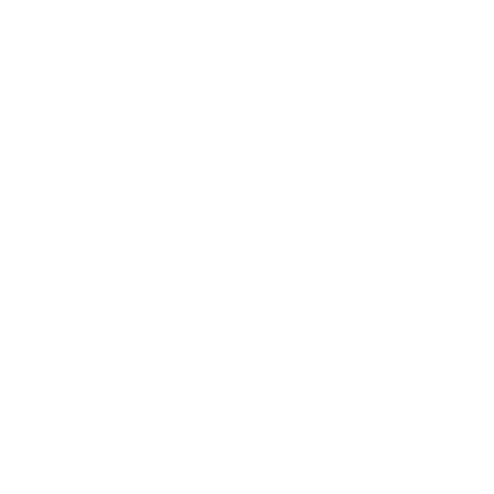

<p align="center">
  
</p>

<p align="center">
  
  
  
  
</p>

---

## 🌟 Tentang TurnCode

**TurnCode** adalah sebuah platform *gamified Learning Management System (LMS)* interaktif berbasis web yang didesain khusus bagi para developer dan penggiat koding untuk menguasai keahlian pemrograman melalui pendekatan belajar yang seru, menantang, dan terstruktur.

Melalui integrasi konsep *gamification* (sistem EXP, leveling, ranking tier, misi harian), TurnCode merubah proses belajar pemrograman yang biasanya monoton menjadi sebuah petualangan coding yang adiktif. Dilengkapi dengan asisten visual **Virtual Coding Buddy**, sistem **Ujian Akhir** yang canggih, dan **Peta Karir/Fokus Belajar Dinamis**, TurnCode siap memandu perjalanan belajarmu dari tingkat pemula (*Initiate*) hingga ahli (*Visionary*).

---

## ⚡ Fitur-Fitur Utama

### 🎯 1. Peta Karir & Fokus Belajar Dinamis (*Dynamic Career Path*)
* **Multi-Interest & Focus Options**: Tersedia berbagai minat utama seperti *Web Dev, Mobile Dev, Cybersecurity, UI/UX,* dan *Game Dev* dengan sub-fokus spesifik (misal: *Frontend, Backend, Flutter, iOS Native, Unity Developer, Digital Forensics*, dll.).
* **Pindah Tujuan Belajar**: Saat user dinyatakan lulus ujian akhir pada salah satu fokus, mereka dapat langsung mengganti minat dan fokus belajarnya ke bidang baru langsung dari dashboard.
* **Auto-Generating Course**: Sistem secara dinamis membuat data *Course, Submateri, Chapter, Lesson,* dan *Quiz* default di database saat user memilih fokus belajar baru yang belum tersedia di database.

### 📝 2. Ruang Ujian Akhir Premium (*Interactive Final Exam*)
* **Tipe Soal Bervariasi**: Mendukung soal Pilihan Ganda (MCQ), Puzzle Susun Kode (Drag & Drop / Tombol Navigasi), dan Tulis Kode Mandiri (*Code Writing*).
* **Mekanisme Anti-Curang & Linear Progression**:
  - **Timer Membaca 15 Detik**: User diwajibkan membaca soal selama 15 detik sebelum opsi jawaban dan tombol navigasi muncul.
  - **Navigasi Searah (Linear)**: Tombol kembali/sebelumnya dinonaktifkan, memastikan siswa mengerjakan ujian secara runut tanpa melompat-lompat.
* **State Persistence (Anti-Reset)**: Menggunakan integrasi `localStorage` dan timestamp start sehingga jawaban, posisi soal saat ini, dan sisa waktu ujian **tidak hilang meskipun halaman di-refresh**.
* **Dua Tahap Konfirmasi**: Tombol kumpulkan ujian menggunakan panel persetujuan dua tahap (menggeser tombol *purple pill slider* ke kanan, diikuti konfirmasi tombol *popup*).

### 🏆 3. Sistem Gamifikasi (*Gamified Levels & Tiers*)
* **Akumulasi EXP & Leveling**: Dapatkan EXP setiap kali menyelesaikan modul pelajaran dan lulus kuis submateri.
* **Tier & Peringkat**: Peringkat user naik secara otomatis sesuai level (mulai dari *Initiate, Explorer, Operator, Specialist* hingga *Visionary*) lengkap dengan efek partikel, notifikasi naik tier, dan warna aksen tier kustom yang memukau.
* **Misi Harian & Heatmap Kontribusi**: Selesaikan misi harian untuk bonus EXP dan pantau konsistensi belajarmu lewat grafik kalender kontribusi.

### 🤖 4. Sistem Virtual Buddy (*Companion System*)
* Pilih asisten visual coding-mu sendiri untuk menemani di dashboard belajar. Asisten ini memberikan tips motivasi, interaksi micro-animation, dan memantau status belajar harianmu.

### 🏢 5. Panel Dashboard Admin Komprehensif
* Kelola kurikulum, submateri, bab, modul, dan bank soal kuis secara instan. Dilengkapi metrik analitik aktivitas siswa, grafik performa, dan fitur login bypass cepat untuk kemudahan debugging lingkungan lokal.

---

## 📁 Struktur Folder Utama

Berikut adalah gambaran ringkas struktur direktori project TurnCode:

```text
TurnCode/
├── app/
│   ├── Http/
│   │   ├── Controllers/       # Controller logika bisnis (Exam, Onboarding, Certificate, dll.)
│   │   └── Middleware/        # Middleware autentikasi dan status onboarding siswa
│   └── Models/                # Eloquent model (User, Course, Submateri, Quiz, Fokus, dll.)
├── bootstrap/                 # Konfigurasi inisialisasi framework
├── config/                    # Kumpulan file konfigurasi Laravel
├── database/
│   ├── migrations/            # Migrasi skema tabel database
│   └── seeders/               # Data seeder untuk materi awal, user admin, dan data master
├── public/
│   ├── css/                   # Stylesheet premium (admin-dashboard.css, dashboard.css, dll.)
│   ├── images/
│   │   └── logo/              # Folder aset logo resmi TurnCode (black / white)
│   └── js/                    # JavaScript interaktif (layout.js, panel.js, dll.)
├── resources/
│   ├── views/                 # Blade template antarmuka pengguna
│   │   ├── admin/             # Layout dan kelola halaman admin dashboard
│   │   ├── exam/              # Halaman persetujuan & ruang ujian akhir (room.blade.php)
│   │   ├── onboarding/        # Halaman orientasi minat & fokus user baru
│   │   ├── partials/          # Template parsial (menu-panel, notifikasi, dll.)
│   │   └── dashboard.blade.php# Dashboard utama siswa
│   └── js/
├── routes/
│   └── web.php                # Rute utama aplikasi
└── vite.config.js             # Konfigurasi build sistem menggunakan Vite
```

---

## 💻 Kebutuhan Perangkat & Sistem (*Device Requirements*)

Sebelum menjalankan project ini, pastikan perangkat Anda memenuhi syarat minimum berikut:

* **Sistem Operasi**: Windows (direkomendasikan menggunakan Laragon), macOS, atau Linux.
* **PHP**: Versi `8.2` atau lebih tinggi.
* **Composer**: Versi `2.0` atau lebih tinggi.
* **Node.js**: Versi `18.0` atau lebih tinggi beserta NPM.
* **Database**: MySQL `8.0+` atau MariaDB `10.4+` (juga mendukung PostgreSQL).
* **Browser**: Chrome, Firefox, Edge, atau Safari (mendukung fitur CSS grid, flexbox, dan HTML5 drag-and-drop).

---

## 🚀 Panduan Instalasi & Menjalankan Project (*Running Locally*)

Ikuti langkah-langkah di bawah ini untuk mengkloning dan menjalankan project TurnCode di lingkungan lokal Anda:

### 1. Kloning Repositori
```bash
git clone https://github.com/HanzzSama/TurnCode.git
cd TurnCode
```

### 2. Instal Dependensi Composer (PHP)
```bash
composer install
```

### 3. Instal Dependensi NPM (JavaScript & Assets Compilation)
```bash
npm install
```

### 4. Salin & Konfigurasi Environment File
Salin file `.env.example` menjadi `.env`:
```bash
copy .env.example .env
```
Buka file `.env` yang baru dibuat dan sesuaikan konfigurasi database Anda:
```env
DB_CONNECTION=mysql
DB_HOST=127.0.0.1
DB_PORT=3306
DB_DATABASE=turncode
DB_USERNAME=root
DB_PASSWORD=
```
*(Catatan: Buat database kosong bernama `turncode` di MySQL Anda terlebih dahulu)*

### 5. Generate Application Key
```bash
php artisan key:generate
```

### 6. Jalankan Migrasi Database dan Seeders
Perintah ini akan membuat semua struktur tabel database dan mengisinya dengan materi kurikulum dasar, data kuis, dan akun simulasi:
```bash
php artisan migrate --seed
```

### 7. Jalankan Server Pengembangan
Jalankan server lokal Laravel (PHP):
```bash
php artisan serve
```
Dan jalankan server kompilasi aset Vite (CSS/JS) secara real-time pada terminal terpisah:
```bash
npm run dev
```

### 8. Akses Aplikasi
* Buka browser Anda dan navigasikan ke: `http://localhost:8000`
* Untuk login cepat sebagai siswa uji coba, Anda bisa menggunakan rute pintas lokal:
  - `http://localhost:8000/bypass-user/2` (Login sebagai siswa **Hanzz**)
  - `http://localhost:8000/bypass-user/1` (Login sebagai siswa **Test User**)
* Untuk mengakses dashboard admin, gunakan rute:
  - `http://localhost:8000/admin/bypass-login`

---

## 👥 Kontributor & Developer

Project ini dikembangkan dan dirawat dengan penuh dedikasi oleh:

* **Haidar Andrianno (HanzzSama)** — Lead Software Architect & Full-Stack Developer
* **Antigravity AI Pair Programmer** — Advanced Agentic Coding Companion (by Google DeepMind team)

---

## 📄 Lisensi

Project TurnCode dirilis di bawah lisensi open-source **MIT License**. Anda bebas menggunakan, mendistribusikan, dan memodifikasi proyek ini sesuai dengan ketentuan lisensi tersebut.
